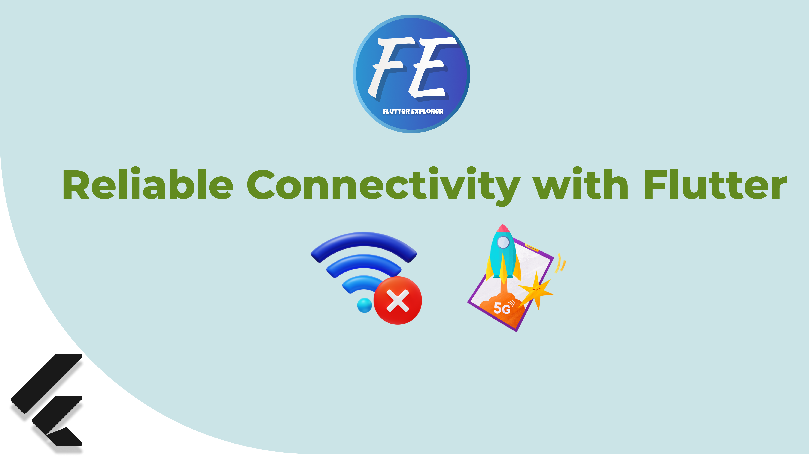

# Streamlined Monitor Connection Setup with Riverpod & Internet Connection Checker

<div align="center">
  
</div>

Streamline your Flutter app's monitor connection setup using Riverpod and Internet Connection Checker. Ensure a reliable user experience by monitoring network connectivity and managing it seamlessly with these powerful tools.

## Table of Contents

- [Streamlined Monitor Connection Setup with Riverpod \& Internet Connection Checker](#streamlined-monitor-connection-setup-with-riverpod--internet-connection-checker)
  - [Table of Contents](#table-of-contents)
  - [Introduction](#introduction)
  - [Features](#features)
  - [Installation](#installation)
  - [Usage](#usage)
  - [Contributing](#contributing)

## Introduction

Welcome to the Streamlined Monitor Connection Setup project! This Flutter project combines the power of Riverpod and Internet Connection Checker to simplify the process of setting up and managing monitor connections in your app. Say goodbye to unreliable connections and hello to a smoother user experience.

## Features

- Monitor Wi-Fi, mobile data, and ping specific addresses for reliability.
- Seamlessly adapt your app to changing network conditions.
- Streamline monitor connection setup with Riverpod and Internet Connection Checker.
- Beginner-friendly tutorial and coding examples.

## Installation

To get started with Streamlined Monitor Connection Setup, follow these installation steps:

1. Add the necessary packages to your `pubspec.yaml` file:

   ```yaml
   dependencies:
     flutter:
       sdk: flutter
     flutter_riverpod: ^latest_version
     internet_connection_checker: ^latest_version
   ```

2. Run `flutter pub get` to fetch and install the packages.

3. Import the packages in your Dart code:

   ```dart
   import 'package:flutter/material.dart';
   import 'package:riverpod/riverpod.dart';
   import 'package:internet_connection_checker/internet_connection_checker.dart';
   ```

## Usage

Learn how to streamline monitor connection setup in your Flutter app by following our step-by-step tutorial. We'll guide you through the process of integrating Riverpod and Internet Connection Checker into your project, ensuring that your app adapts seamlessly to changing network conditions.

For the full tutorial and code examples, please visit [https://youtu.be/WliFlL2VfBM].

## Contributing

We welcome contributions to this project. If you find a bug or have an enhancement idea, please open an issue or submit a pull request. 

